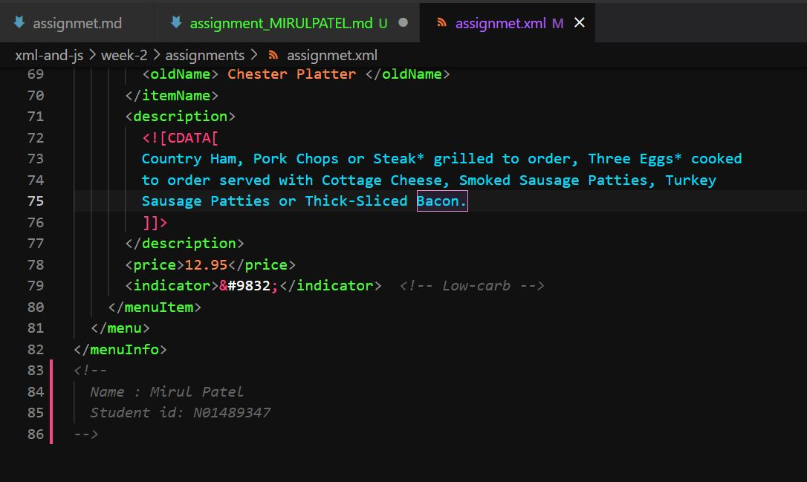
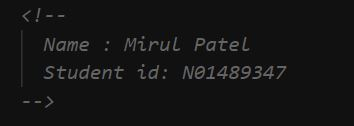
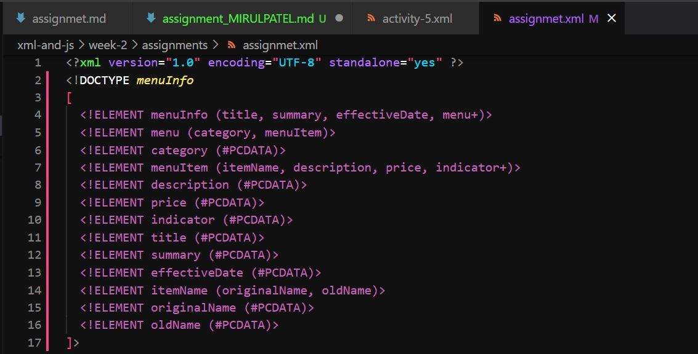

1. Yes, there are was a error in xml tag (<effective Date>).The space in the tag has generated error so to solve that error, I have removed the space from that tag(<effectiveDate>).
cause: you can't leave/add the space in XML tag.

2. Parser simply prints that block or text as it is because the text between CDATA can't be parsed by parser.

3. 

4. prolog: <?xml version="1.0" encoding="UTF-8" standalone="yes" ?>
______________________________________________________________________________________________________________

Document body: 
<!-- 
 <menuInfo>
  <title>Chester's Breakfast Menu</title>
  

    <![CDATA[
    If you've been craving an authentic homestyle country breakfast,
    look no further than Chester's!  We've got your breakfast favorites served
    up just the way you like them!!
    ]]>
  

  <effectiveDate>03/12/2016</effectiveDate>
  <menu>
    <category>Traditional Favorites</category>
    <menuItem>
      <itemName>
        <originalName> Rise n' Shine</originalName>
        <oldName> Shine </oldName>
      </itemName>
      <description>
        <![CDATA[
        Two Eggs* cooked to order with Grits, Gravy and Homemade Buttermilk
        Biscuits along with real Butter and the best fresh jam
        available. Served with your choice of Fresh Fruit or Hashbrown Casserole
        and Smoked Sausage Patties, Turkey Sausage Patties or Thick-Sliced Bacon.
        ]]>
      </description>
      <price>7.95</price>
    </menuItem>
    <menuItem>
      <itemName>
        <originalName> Fresh Mornin' Sampler </originalName>
        <oldName> Mornin' Sampler </oldName>
      </itemName>
      <description>
        <![CDATA[
        Low-Fat Vanilla Yogurt and Seasonal Fruit topped with our Honey Granola
        mix of Almonds and Dried Fruit. Served with a Wild Maine Blueberry Muffin
        or an Apple Bran Muffin.
        ]]>
      </description>
      <price>6.95</price>
      <indicator>&#9829;</indicator>  
      <indicator>&#9830;</indicator>  
      <indicator>&#9824;</indicator>  
    </menuItem>
  </menu>
  <menu>
    <category>Lite and Quick</category>
    <menuItem>
      <itemName>
        <originalName> Oatmeal Breakfast </originalName>
      </itemName>
      <description>
        <![CDATA[
        Our Oatmeal is served warm with your choice of Fried Apples, Pecans, Raisins,
        Fresh Sliced Bananas or 100% Pure Natural Syrup. Also, served with your
        choice of Apple Bran Muffin or Wild Maine Blueberry Muffin. Available
        all day.
        ]]>
      </description>
      <price>6.95</price>
      <indicator>&#9829;</indicator>  
      <indicator>&#9830;</indicator>  
      <indicator>&#9824;</indicator>  
    </menuItem>
    <menuItem>
      <itemName>
        <originalName> Chester's Meat Platter </originalName>
        <oldName> Chester Platter </oldName>
      </itemName>
      <description>
        <![CDATA[
        Country Ham, Pork Chops or Steak* grilled to order, Three Eggs* cooked
        to order served with Cottage Cheese, Smoked Sausage Patties, Turkey
        Sausage Patties or Thick-Sliced Bacon.
        ]]>
      </description>
      <price>12.95</price>
      <indicator>&#9832;</indicator>  
    </menuItem>
  </menu>
</menuInfo>
 -->
epilog:

&
<!-->
<?xml-stylesheet type="text/css" href="style.css"?>
-->

5. 

6. 

7.I have added style.css